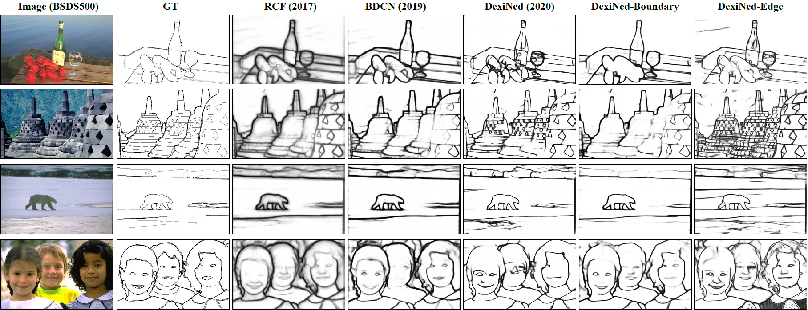

[](https://paperswithcode.com/sota/edge-detection-on-biped?p=dense-extreme-inception-network-towards-a)

# Dense Extreme Inception Network: Towards a Robust CNN Model for Edge Detection (DexiNed)

<!-- ```diff
- Sorry for any inconvenience, we are updating the repo
``` -->
```diff
- We have just updated the last version of DexiNed in Pytorch.
- The implementation with TF1 is fransfered to the "legacy" dir.
- These days we are going to updated minor changes but the model, 
  loss function, and the testing and training procedures does not need changes,
  hopefully :), if you have time please check errors and let me know
  in Issues.

```

This is the extended work from DexiNed presented in WACV2020. We have improved the architecture and the dataset. Unlike of the state-of-the-art CNN based edge detectors, this models has a single training stage, but it is still able to overcome those models in edge detection datasets. Moreover, Dexined does not need pre-trained weights, and it is trained from the scratch with fewer parameters tunning. To know more about DexiNed, read our first version of Dexined in [arxiv](https://arxiv.org/abs/1909.01955), the extended version will be available soon in ARXIV. The last version of DexiNed is implemented in Pytorch, in TF2 it will be available soon. If to want our preliminary version, please check legacy DIR.

<div style="text-align:center">

## Table of Contents
* [DexiNed-v1](#dexiNed-v1)
* [TensorFlow](#tensorflow2)
* [Datasets](#datasets)
* [Performance](#performance)
* [Citation](#citation)

# DexiNed-v1

This version was presented in WACV2020, this is the base DexiNed model [implemented in TensorFlow 1](https://github.com/xavysp/DexiNed/tree/master/legacy)


# TensorFlow2

Dexined version on TF 2 is not ready 
## Requirements

* [Python 3.7](https://www.python.org/downloads/release/python-370/g)
* [Pytorch >=1.4](https://pytorch.org/) (Last test 1.9)
* [OpenCV](https://pypi.org/project/opencv-python/)
* [Matplotlib](https://matplotlib.org/3.1.1/users/installing.html)
* [Kornia](https://kornia.github.io/)
* Other package like Numpy, h5py, PIL, json. 

Once the packages are installed,  clone this repo as follow: 

    git clone https://github.com/xavysp/DexiNed.git
    cd DexiNed

## Project Architecture

```
├── data                        # Sample images for testing (paste your image here)
|   ├── lena_std.tif            # Sample 1
├── DexiNed-TF2                 # DexiNed in TensorFlow2 (in construction)   
├── figs                        # Images used in README.md
|   └── DexiNed_banner.png      # DexiNed banner
├── legacy                      # DexiNed in TensorFlow1 (presented in WACV2020)
├── utls                        # A series of tools used in this repo
|   └── image.py                # Miscellaneous tool functions
├── datasets.py                 # Tools for dataset managing 
├── dexi_utils.py               # New functions still not used in the currecnt version
├── losses.py                   # Loss function used to train DexiNed (BDCNloss2)
├── main.py                     # The main python file with main functions and parameter settings
                                # here you can test and train
├── model.py                    # DexiNed class in pythorch
```

Before to start please check dataset.py, from the first line of code you can see the datasets used for training/testing. The main.py, line 194, call the data  for the training or testing, see the example of the code below:
```
    parser = argparse.ArgumentParser(description='DexiNed trainer.')
    parser.add_argument('--choose_test_data',
                        type=int,
                        default=1,
                        help='Already set the dataset for testing choice: 0 - 8')
    # ----------- test -------0--

    TEST_DATA = DATASET_NAMES[parser.parse_args().choose_test_data] # max 8
    test_inf = dataset_info(TEST_DATA, is_linux=IS_LINUX)
    test_dir = test_inf['data_dir']
    is_testing = True# current test -352-SM-NewGT-2AugmenPublish

    # Training settings
    TRAIN_DATA = DATASET_NAMES[0] # BIPED=0
    train_inf = dataset_info(TRAIN_DATA, is_linux=IS_LINUX)
    train_dir = train_inf['data_dir']
```

## Test
As previously mentioned, the datasets.py has, among other things, the whole datasets configurations used in DexiNed for testing and training:
```
DATASET_NAMES = [
    'BIPED',
    'BSDS',
    'BSDS300',
    'CID',
    'DCD',
    'MULTICUE', #5
    'PASCAL',
    'NYUD',
    'CLASSIC'
] 
```
For example, if want to test your own dataset or image choose "CLASSIC" and save your test data in "data" dir.
Before test the DexiNed model, it is necesarry to download the checkpoint here [Checkpoint Pytorch](https://drive.google.com/file/d/1V56vGTsu7GYiQouCIKvTWl5UKCZ6yCNu/view?usp=sharing) and save this file into the DexiNed folder like: checkpoints/BIPED/10/(here the checkpoints from Drive), then run as follow:

```python main.py --choose_test_data=-1 ```
Make sure that in main.py the test setting be as:
```parser.add_argument('--is_testing', default=True, help='Script in testing mode.')```
DexiNed downsample the input image till 16 scales, please make sure that, in dataset_info fucn (datasets.py), the image width and height be multiple of 16, like 512, 960, and etc. **In the Checkpoint from Drive you will find the last trained checkpoint, which has been trained in the last version of BIPED dataset that will be updated soon in Kaggle **

## Train

    python main.py 
Make sure that in main.py the train setting be as:
```parser.add_argument('--is_testing', default=False, help='Script in testing mode.')```

# Datasets

## Dataset used for Training
```diff
- The BIPED dataset has been updated to the last version and it can be download from Kaggle

```

BIPED (Barcelona Images for Perceptual Edge Detection): This dataset is collected and annotated in the edge level for this work. **See more details, augmentation script, and download** in: [Option1](https://xavysp.github.io/MBIPED/), [Option2 kaggle](https://www.kaggle.com/xavysp/biped). The BIPED dataset has been updated, adding more annotations and correcting few mistakes, so those links have the renewed version of BIPED, if you want the older version you may ask us by email. The last performance (table below) will be updated soon. 

## Datasets used for Testing

Edge detection datasets
* [BIPED](https://xavysp.github.io/MBIPED/) and [MDBD](http://serre-lab.clps.brown.edu/resource/multicue/)

Non-edge detection datasets

* [CID](http://www.cs.rug.nl/~imaging/databases/contour_database/contour_database.html) <!-- * [DCD](http://www.cs.cmu.edu/~mengtial/proj/sketch/)-->, [BSDS300](https://www2.eecs.berkeley.edu/Research/Projects/CS/vision/bsds/), [BSDS500](https://www2.eecs.berkeley.edu/Research/Projects/CS/vision/bsds/), [NYUD](https://cs.nyu.edu/~silberman/datasets/nyu_depth_v2.html), and [PASCAL-context](https://cs.stanford.edu/~roozbeh/pascal-context/)

# Performance

The results below are from the last version of BIPEP. After WACV20, the BIPED images have been again checked and added annotations. All of those models have been trained again. 

<center>

|     Methods    |    ODS   |    ODS   |    AP    |
| -------------- | ---------| -------- | -------- |
| [SED](https://github.com/ArashAkbarinia/BoundaryDetection) before     | `.717` | `.731` | `.756` |
| [SED](https://github.com/ArashAkbarinia/BoundaryDetection)      | `.000` | `.000` | `.000` |
| [HED](https://github.com/s9xie/hed) before     | `.823` | `.847` | `.869` |
| [HED](https://github.com/s9xie/hed)     | `.000` | `.000` | `.000` |
| [RCF](https://github.com/yun-liu/rcf) before     | `.843` | `.859` | `.882` |
| [RCF](https://github.com/yun-liu/rcf)      | `.000` | `.000` | `.000` |
| [BDCN](https://github.com/pkuCactus/BDCN) before    | `.839` | `.854` | `.887` |
| [BDCN](https://github.com/pkuCactus/BDCN)     | `.000` | `.000` | `.000` |
| DexiNed(WACV'20)| `.859` | `.867` | `.905` |
| DexiNed(Ours)| `.000` | `.000` | `.000` |
</center>
Evaluation performed to BIPED dataset. We will update the result soon.

# Citation

If you like DexiNed, why not starring the project on GitHub!

[](https://GitHub.com/xavysp/DexiNed/stargazers/)

Please cite our paper if you find helpful in your academic/scientific publication,
```
@InProceedings{soria2020dexined,
    title={Dense Extreme Inception Network: Towards a Robust CNN Model for Edge Detection},
    author={Xavier Soria and Edgar Riba and Angel Sappa},
    booktitle={The IEEE Winter Conference on Applications of Computer Vision (WACV '20)},
    year={2020}
}
```

<!--```
@misc{soria2020dexined_ext,
    title={Towards a Robust Deep Learning Model for Edge Detection},
    author={Xavier Soria and Edgar Riba and Angel Sappa},
    year={2020},
    eprint={000000000},
    archivePrefix={arXiv},
    primaryClass={cs.CV}
```-->

